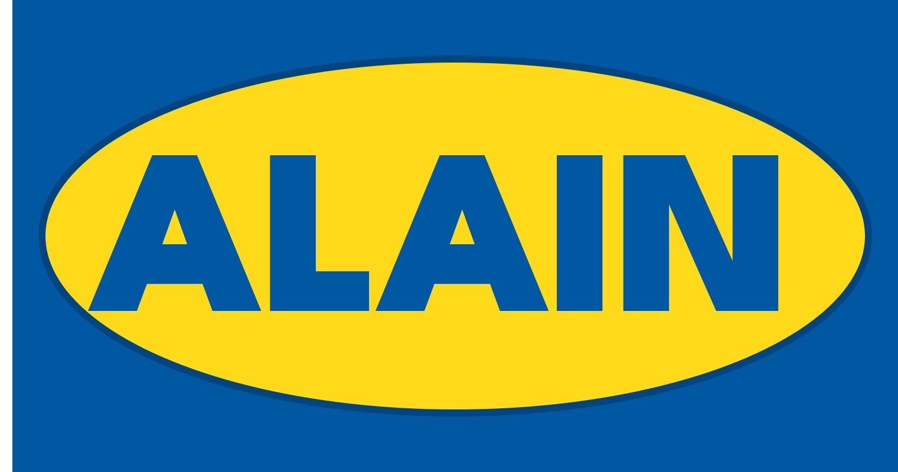

  

   
   

  
  
  
  
  

# ALAIN — Applied Learning AI Notebooks
The open‑source “IKEA‑style” instruction layer for AI models.

Paste any model (Hugging Face, Ollama, LM Studio) → get a runnable, step‑by‑step lesson. Export to Jupyter/Colab. Run locally or hosted with identical UX.

---

## Quick Links
- Live Demo: https://alain-ruddy.vercel.app
- Try Now: https://alain-ruddy.vercel.app/generate
- Developer Guide: `web/docs/DEVELOPER_GUIDE.md`
- Devpost Write‑Up: `hackathon-notes/DEVPOST-Submission.md`
- Hackathon: https://openai.devpost.com

---

## What Is ALAIN?
ALAIN turns a model reference into an interactive tutorial that teaches setup, safe usage, and best practices. It generates a lesson you can run in‑browser and export to a notebook — no heavy backend required.

### Why ALAIN
- Paste a model link → get a guided, runnable lesson.
- Works online or fully local via OpenAI‑compatible endpoints (e.g., Ollama, LM Studio).
- In‑browser execution for Python (Pyodide) and JS/TS (Web Worker).
- One‑click export to Jupyter/Colab for sharing and grading.

### Inspiration
Docs are passive, scattered, and often not runnable. New models drop weekly but “hello world” still takes hours. ALAIN makes models learnable in minutes by turning any reference (Hugging Face, local, hosted) into a step‑by‑step, graded lesson you can actually run.

---

## Try It In 2 Minutes
1) Open the demo and pick “From Text” → https://alain-ruddy.vercel.app/generate
2) Paste a model (e.g., https://huggingface.co/openai/gpt-oss-20b) and click Generate
3) Open the tutorial, run a step, Export to Colab

Tip: On Vercel or web‑only use, enable “Force fallback mode (no backend)” on the Generate page.

---

## Local Setup (Web)
- Requirements: Node.js 18+
- Steps:
  - `cd web && npm install && npm run dev`
  - Create `web/.env.local` with Clerk + GitHub vars (see `env-config-example.txt`)
  - Open http://localhost:3000 and head to `/generate`

Optional: Configure Upstash (KV) and GitHub export to open PRs for lessons.

---

## Features
- Gallery with search, filters, thumbnails
- Upload drafts, Request Publish, and admin moderation
- Notebook viewer + editor (Monaco + Markdown), drag‑reorder, metadata
- Client‑side runners: Python (Pyodide), JS/TS (Worker)
- Export to ALAIN JSON and open a GitHub PR
- Optional caching with Upstash to reduce GitHub reads

---

## How It Works
- Teacher: GPT‑OSS‑20B synthesizes lessons under a strict JSON schema with auto‑repair.
- Providers: Hosted (Poe) and OpenAI‑compatible (local: Ollama/LM Studio) share the same request shape.
- Execution: Runs client‑side for quick feedback; server execution path stubbed for future sandboxing.

### Why GPT‑OSS‑20B (Teacher)
- Open weights and local‑first: runs on Ollama/LM Studio with the same API shape as hosted endpoints.
- Strong instruction following: produces stepwise, teachable content with minimal prompt overhead.
- Reliable JSON: high schema adherence with fewer repair passes.
- Practical fit: fast enough for iterative generation and real‑time previews.

---

## Tech At A Glance
- Frontend: Next.js (App Router), React, Tailwind, Monaco, @uiw/react-md-editor
- Auth: Clerk (GitHub/Hugging Face via Clerk)
- Storage: GitHub Contents API
- Optional Cache: Upstash Redis (lazy‑loaded)
- Backend: Encore.dev TypeScript services (execution, tutorials, export)
- Export: nbformat/Jupyter; in‑browser Colab rendering

---

## Repository Structure
- `web/`: Next.js app (UI, editors, in‑browser runners)
- `backend/`: Encore.dev TypeScript services
- `prompts/`: ALAIN‑Kit prompt templates
- `schemas/`: Lesson JSON schema
- `examples/poe/`: Standalone Poe API examples
- `hackathon-notes/`: Devpost materials and judging notes
- `scripts/`: Smoke tests and conversion utilities
- `test_sandbox/`: Scratch tests and local notes (ignored by git). Put temporary test scripts and outputs here to avoid cluttering the root.

---

## Testing Instructions
- No login required for core flow.
- Web‑only fallback:
  - Open https://alain-ruddy.vercel.app/generate
  - Enable “Force fallback mode (no backend)”
  - Paste model: https://huggingface.co/openai/gpt-oss-20b
  - Click Generate → open tutorial → run a step → Export to Colab
- Local quick check:
  - `cd web && npm install && npm run dev`
  - Visit http://localhost:3000/generate, enable fallback, repeat steps above
- Optional offline (Ollama):
  - `ollama pull gpt-oss:20b`
  - In app, choose Local/OpenAI‑compatible and set model `gpt-oss:20b`

---

## Devpost Write‑Up
See `hackathon-notes/DEVPOST-Submission.md` for the full story, judging guidance, and screenshots.

## License

MIT License — see `LICENSE` for full text.
