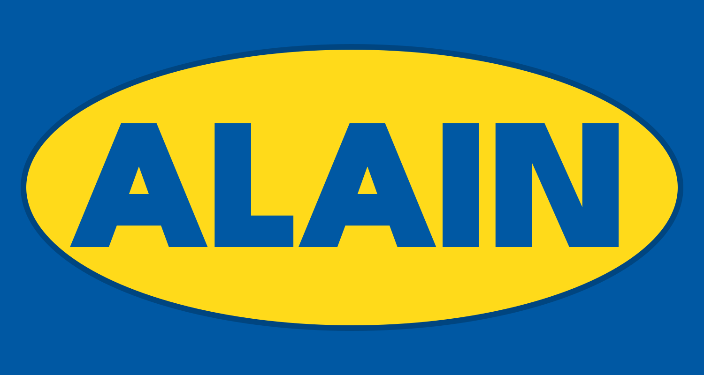

<div align="center">

  

  <br/>
  <br/>

  <a href="https://opensource.org/licenses/MIT"></a>
  <a href="https://openai.devpost.com"></a>
  <a href="https://huggingface.co/openai/gpt-oss-20b"></a>
  <a href="https://developer.poe.com/server-bots"></a>
  <a href="docs/README.md"></a>
  <a href="https://leap.new"></a>

  <br/>
  <br/>

  <p><strong>AI Manuals for AI Models.</strong></p>
  <p>Paste a model card and get a runnable, graded manual in minutes—no more guessing at the screws.</p>

</div>

> Built for the <strong>OpenAI Open Model Hackathon</strong> (openai.devpost.com) and awarded 🥉 <strong>3rd place</strong> at the <a href="https://leap.new">leap.new Open Source Hackathon 2025</a>.

---

## Why ALAIN

New models ship faster than instructions to use them. They’re the IKEA pieces dumped on your floor—full of potential, but unusable without a manual. ALAIN is that manual, born during the OpenAI Open Model Hackathon to make “model release → model running” a matter of minutes.

- **Paste any Hugging Face model reference** and ALAIN builds a guided notebook lesson with pedagogy baked in.
- **Run it anywhere** — hosted (Poe), BYOK OpenAI-compatible endpoints, or fully local (Ollama / LM Studio) using the same request shape.
- **Learn by doing** — each lesson includes setup, safe parameterized runs, quick checks, and Colab/Jupyter export.

AI adoption follows instructions. ALAIN provides them for any model.

---

## Quick Start

### CLI (ALAIN‑Kit SDK)

```bash
# Install dependencies (root). This also builds the packages via prepare hooks.
npm install

# (Optional) rebuild the packages manually while iterating on the kit
npm run alain:build

# Generate a manual from the CLI
env POE_API_KEY=your_key \
npm run alain:cli -- \
  --model gpt-oss-20b \
  --baseUrl https://api.poe.com \
  --difficulty beginner \
  --maxSections 6 \
  --outDir output/manuals
```

The CLI writes:
- `*.ipynb` – runnable notebook manual
- `alain-validation-*.md` – quality + readability report
- `alain-metrics-*.json` – structured metrics (sections, FK grade, Markdown ratio, timings)
- `.env.local.example` – seeded if you haven’t created one yet

### Web App

```bash
npm install
npm run dev:hosted          # or npm run dev:offline for local providers
```

Then visit <http://localhost:3000/generate> and drop in a model URL (e.g., https://huggingface.co/openai/gpt-oss-20b). Toggle “Force fallback (no backend)” for web-only demos.

#### Swap providers quickly

- **Teacher (outline/section generation)** — set `--baseUrl` (or `ALAIN_BASE_URL`) to any OpenAI-compatible endpoint. Leave it blank for Poe or point it at `http://localhost:11434` for Ollama/vLLM. Local runs can skip `--apiKey`.
- **Notebook runtime** — notebooks include a provider setup cell. Set `OPENAI_BASE_URL`/`OPENAI_API_KEY` (or `POE_API_KEY`) in your `.env` to swap between Poe, local vLLM, or other APIs with no code edits.

#### Local GPT-OSS teacher checklist

- Install the refreshed stack: `pip install -U transformers kernels accelerate triton` (PyTorch >= 2.8 already bundles Triton 3.4).
- When loading `openai/gpt-oss-20b`, pass `use_kernels=True` to fetch the Hub-hosted Liger RMSNorm and MegaBlocks MoE kernels. Compare this bf16 path with the default MXFP4 run to match your VRAM budget.
- Hopper-class GPUs can enable Flash Attention 3 sinks by setting `attn_implementation="kernels-community/vllm-flash-attn3"`.
- MXFP4 kernels load automatically when supported; Transformers falls back to bf16 if Triton kernels aren’t available.

### Backend APIs (Encore.dev)

```bash
npm install
npm --workspace apps/backend run dev
```

Key endpoints live under `apps/backend/execution/*` (lesson generation, execution router, exports).

---

## What You Get

- **Manuals on demand** – Paste URL → get a structured, interactive lab with learning objectives, setup, “Try it yourself” prompts, and troubleshooting.
- **Safe, parameterized execution** – No arbitrary code; lessons run with explicit inputs and cost/latency visibility.
- **Colab/Jupyter ready** – Exported notebooks include environment setup helpers, `.env` management, and client/provider smoke tests.
- **Local-first support** – Identical notebook + CLI workflow whether you’re on Poe, OpenAI, vLLM, Ollama, or LM Studio.
- **Quality gates** – Strict JSON schema, auto-repair, readability metrics, and Colab compatibility validation (with new subprocess pip guard checks).

---

## Architecture Snapshot

| Layer | Highlights |
| ----- | ---------- |
| **Teacher** | `gpt-oss-20b` (Harmony prompt) generates outlines and sections; retries + repair for spec compliance |
| **Pipelines** | `packages/alain-kit` core orchestrates outline → sections → notebook build → validation |
| **Runners** | Web: Next.js + Monaco + Pyodide/Worker; Backend: Encore.dev TypeScript services |
| **Providers** | Poe API (default) and any OpenAI-compatible base URL; offline supported |
| **Observability** | Structured logging, metrics (`GET /execution/metrics`), timing/tracing in ALAIN‑Kit core |

See `docs/architecture/` for the detailed diagrams and the lesson schema in `resources/schemas/alain-lesson.schema.json`.

---

## Try It Live

- **Demo** (alpha): <https://alain-ruddy.vercel.app>
- **Generate now**: <https://alain-ruddy.vercel.app/generate>
- **Notebooks gallery**: `/notebooks` within the app
- **Upcoming**: 🎥 Full demo video (in production)

---

## Project Structure

```
.
├── apps
│   ├── backend        # Encore.dev services, execution router, exports
│   └── web            # Next.js app (lesson builder, gallery, SSE runners)
├── packages
│   └── alain-kit-sdk  # CLI + SDK entry points (ALAIN-Kit)
├── resources          # Brand assets, schemas, research outputs
├── tests              # Notebook + validator smoke suites
└── docs               # Operations, developer guides, prompts
```

---

## Testing & Validation

- **Unit tests (backend + web)**: `npm run test:pure`
- **CLI smoke tests**: `npm run alain:example`
- **Notebook validation**: `npm run validate:lesson path/to/lesson.json`
- **Colab validator coverage**: `backend/validation/colab-validator.test.ts` ensures subprocess pip installs are guarded automatically. Manual instructions live in `TESTING_INSTRUCTIONS.md` (Section 6).
- **Prompt sync check**: `npm run lint:prompts` verifies the packaged prompt templates match the root prompts (ideal for CI).

---

## Roadmap Highlights

- Community lesson hub with remix + quality scoring
- One-click local agent mode (default Ollama profiles)
- GPT‑OSS‑120B teacher option (router-ready)
- Fine-tuning workshops (LoRA/QLoRA) generated automatically

Feedback, ideas, or contributions are welcome—open an issue or ping `@danielgreen`.

---

## License

MIT © 2025 Applied Learning AI Notebooks

---

## Acknowledgements

ALAIN started as a leap.new Open Source Hackathon project and continues thanks to contributors exploring better ways to learn AI through practice. Manuals beat guesswork—thanks for helping models teach themselves.
